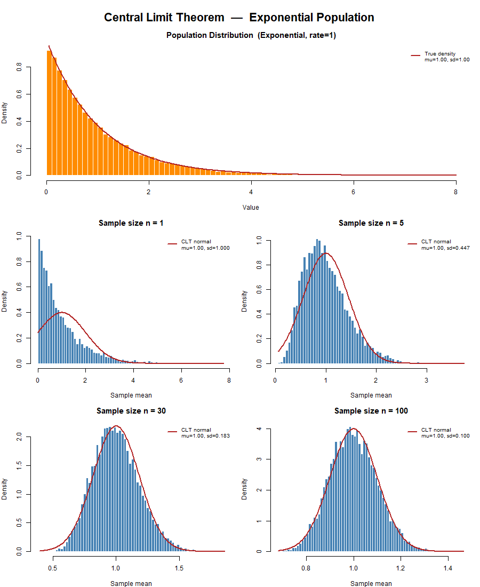

# Central Limit Theorem — R Demonstration

An R script that visually demonstrates the Central Limit Theorem (CLT) using a skewed exponential population.

## What it does

The CLT states that the distribution of sample means approaches a normal distribution as sample size increases, regardless of the shape of the original population.

The script:
- Generates a large exponential population (mean = 1, SD = 1)
- Simulates 10,000 sample means for sample sizes n = 1, 5, 30, and 100
- Plots the population distribution alongside the sampling distributions
- Overlays the CLT-predicted normal curve on each panel
- Prints a numerical comparison of empirical vs. predicted means and standard deviations
- Runs Shapiro-Wilk normality tests to quantify convergence to normality

## Output



## Requirements

- R (any recent version)

No additional packages are needed — the script uses only base R.

## Usage

```r
source("central_limit_theorem.R")
```

Or run from the terminal:

```bash
Rscript central_limit_theorem.R
```

The plot is saved to `central_limit_theorem.png` in the same directory.
